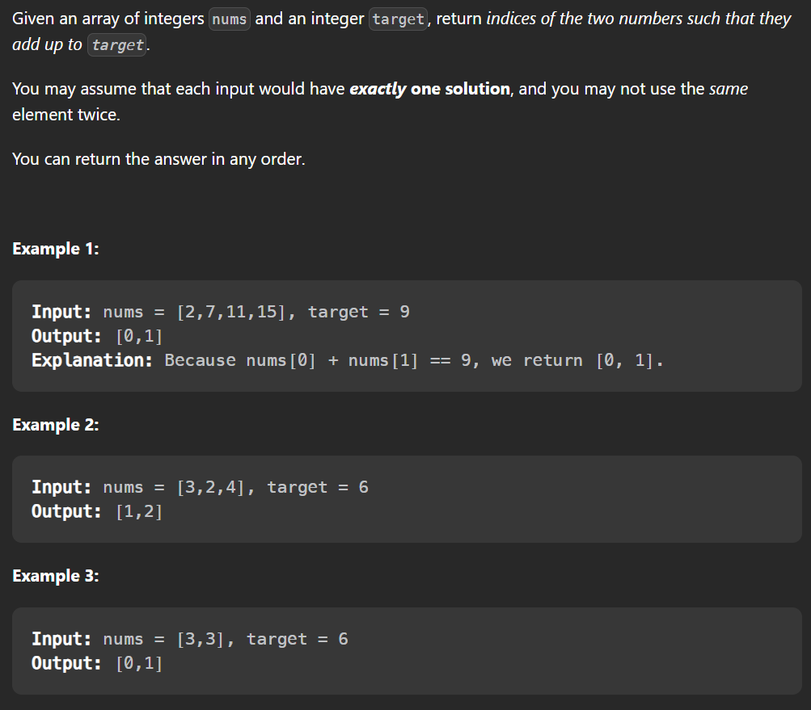
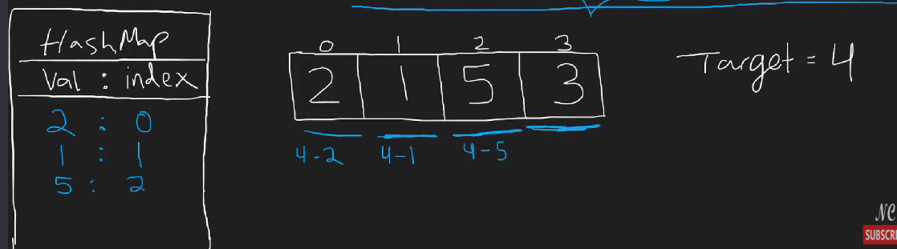

## Solution
1. create empty dict
2. `for i in range(len(nums))`
3. if the value (`nums[i]`) in dict already return output
4. if not → add `target-nums[i]` in to the dict

the key is instead of create dict pair at first (like the commented solution), we create `target-nums[i]` pair instead



```python
class Solution(object):
    def twoSum(self, nums, target):
        """
        :type nums: List[int]
        :type target: int
        :rtype: List[int]
        """

        # dict_pair = {k: v for v, k in enumerate(nums)}

        # for i, num in enumerate(nums):
        #     num_inv = target - num
        #     if num_inv in nums:
        #         if i != dict_pair[num_inv]:
        #             return [i, dict_pair[num_inv]]
        #             break

                
        hashm = {}

        for i in range(len(nums)):
            if nums[i] in hashm.keys():
                return [hashm[nums[i]], i]
                break
            else:
                hashm[target-nums[i]] = i

```