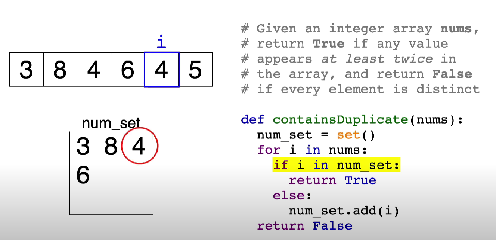

[- LeetCode](https://leetcode.com/problems/contains-duplicate/description/)

Given an integer array `nums`, return `true` if any value appears **at least twice** in the array, and return `false` if every element is distinct.

[🌲contains duplicate hashmap](🌲contains%20duplicate%20hashmap.md)

```python
class Solution(object):
    def containsDuplicate(self, nums):
        """
        :type nums: List[int]
        :rtype: bool
        """

        hash = set()
        
        for num in nums:
            # check if num is already in `hash` or not
            if num in hash:
                # if yes mean that got duplicated -> return `True`
                return True
            # if not added it
            else:
                hash.add(num)
        return False

print(Solution().containsDuplicate([512415, 123]))
print(Solution().containsDuplicate([123456]))
```


