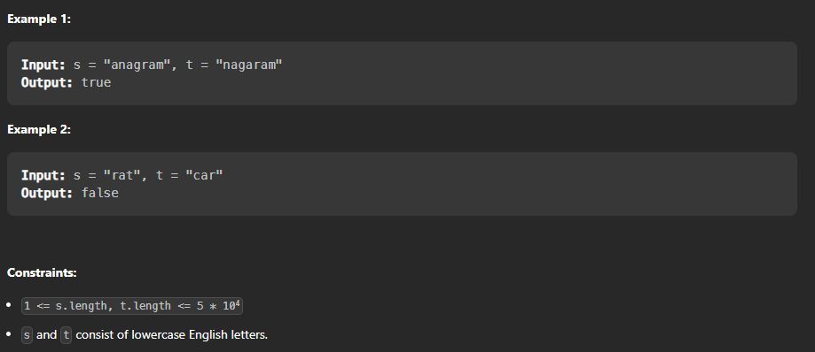

Given two strings `s` and `t`, return `true` _if_ `t` _is an anagram of_ `s`_, and_ `false` _otherwise_.

An **Anagram** is a word or phrase formed by rearranging the letters of a different word or phrase, typically using all the original letters exactly once.



solution
1. first if length of both string not equal so we can confirm it isn’t anagram return `False`
2. for loop each char in string then count that char in string compare together
	1. if != return `False`
3. if == for all char so return `True`


```python
class Solution(object):
    def isAnagram(self, s, t):
        """
        :type s: str
        :type t: str
        :rtype: bool
        """

        # if len != return False
        if len(s) != len(t):
            return False
        
        for char in set(s):
            # count that char and compare together
            if s.count(char) != t.count(char):
                return False
        return True

print(Solution().isAnagram('rat', 'art'))

```

[[../🌲count char in strings]] 
