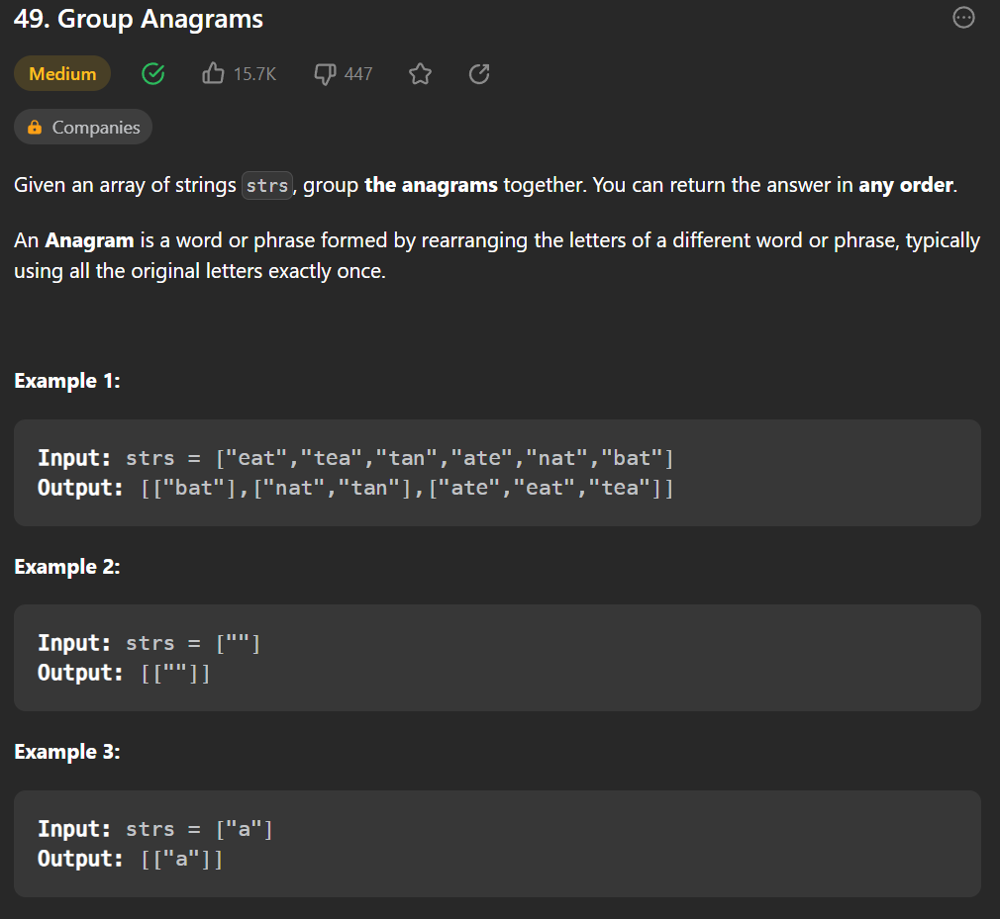

#leetcode/arrays 


```python
# Creating a class named Solution
class Solution(object):
    # Defining a function named groupAnagrams that takes a list of strings as input and returns a list of lists of strings as output
    def groupAnagrams(self, strs):
        
        # Creating an empty dictionary named table
        table = {}
        
        # Creating an empty list named sort_strs
        sort_strs = []
        
        # Looping through each string in the input list
        for i in range(len(strs)):
            # Sorting the characters in the current string and joining them back into a single string
            sort_text = ''.join(sorted(strs[i]))
            # Appending the sorted string to the sort_strs list
            sort_strs.append(sort_text)
            # Creating an empty list as the value in the table dictionary with the sorted string as the key
            table[sort_text] = []
        
        # Looping through each sorted string in the sort_strs list
        for i in range(len(sort_strs)):
            # Appending the current string to the list associated with its sorted string in the table dictionary
            table[sort_strs[i]].append(strs[i])
        
        # Creating an empty list named res
        res = []
        
        # Looping through each key-value pair in the table dictionary
        for k, v in table.items():
            # Appending the list of strings to the res list
            res.append(v)
        
        # Returning the final result
        return res

```

commented by ChatGPT